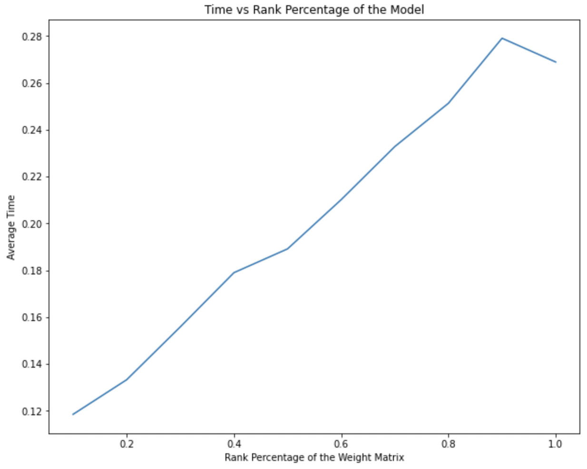
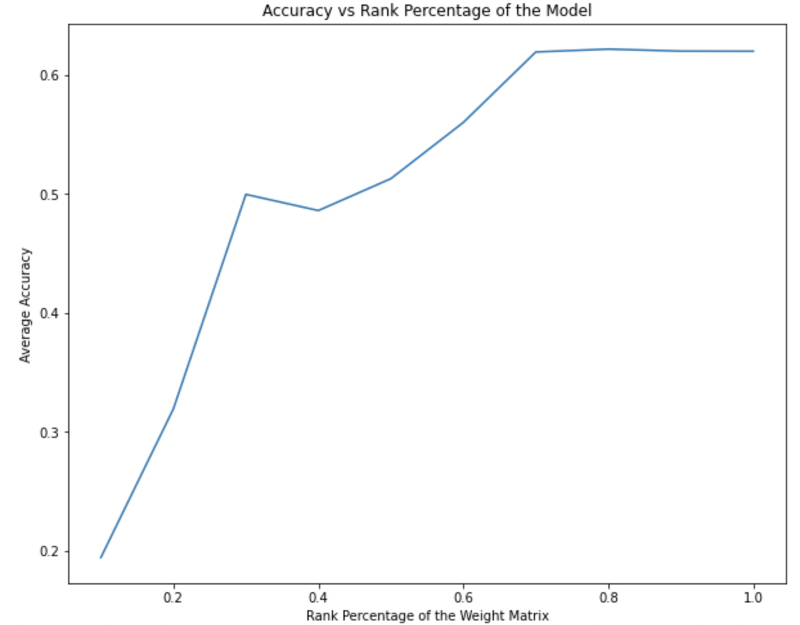
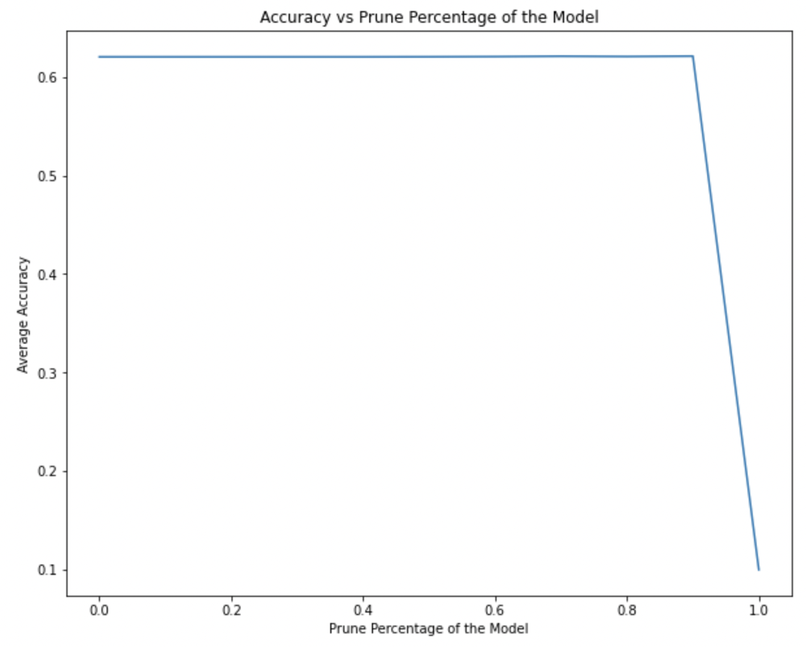
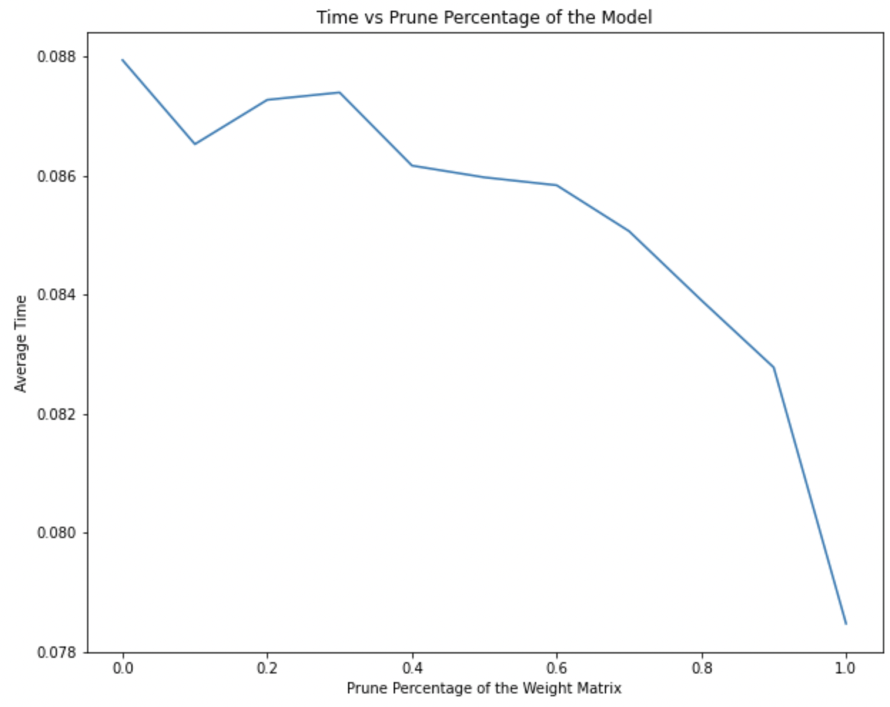

# Model Compression
Here I discuss Neural Network Compression using two quite popular methods:
- Singular Value Decomposition
- Weight Pruning

## Comparison between Methods
I summarize the experimental findings of both the methods in terms of the metric `Accuracy` and `Inference Time` on `CIFAR10` dataset.

Method|Accuracy|Inference Time
-|-|-
SVD||
Pruning||

It is clear that weight pruning is significantly better with larger fraction of model compressed due to sparsity! If implemented on a sparse specific hardware, it can generate fast inferences reliably.

### Frameworks
I used two new frameworks for this work:
- Jax
- Haiku

### Notebooks
The entire work is elaborated and implemented in `NN_Model_Compression.ipynb` notebook
